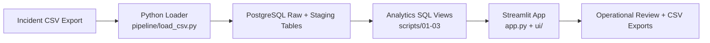

# IncidentOps PMI Hub

IncidentOps PMI Hub is a portfolio-grade process mining and operations analytics project for incident management event logs. It combines Python ETL, PostgreSQL analytics modeling, and a Streamlit decision-support application to show how a service desk can move from flat averages to end-to-end flow visibility, bottleneck detection, closure quality review, and improvement planning.

## What This Project Demonstrates
- Python-based ingestion and validation for semi-structured operational exports
- PostgreSQL schema design and analytical view modeling for process mining metrics
- Streamlit + Plotly dashboard design for multi-stakeholder operational reviews
- Requirements-driven delivery grounded in a formal Functional Requirements Document
- End-to-end reproducibility: load data, build analytics objects, run the app, and verify behavior

## Business Problem And Outcomes
Service desk leaders often have raw incident exports but no reliable way to see how cases actually move across intake, assignment, work-in-progress, escalation, resolution, closure, and feedback. That makes it hard to distinguish healthy flow from expensive patterns such as long dwell times, escalation ping-pong, or premature closure that drives reopens.

This project addresses that gap by turning a case event log into a repeatable analytics layer and reviewer-friendly operational dashboard. The core outcomes are:
- Make incident flow visible through variants and transition analysis
- Reduce cycle time by exposing dwell-time bottlenecks
- Quantify escalation and handoff churn
- Improve closure governance and customer experience review
- Produce operational exports that support weekly review and problem-management follow-up

## Key Features
- Idempotent CSV ingestion into PostgreSQL with validation, canonical event mapping, and duplicate protection
- Analytical SQL views for case lifecycle metrics, SLA compliance, variants, transitions, dwell time, handoffs, closure governance, FCR, and problem candidates
- Streamlit workstreams for `Command Center`, `Flow`, `Handoffs`, `Quality`, `Intake`, and `Enablement`
- Persistent global filtering across pages for date range, priority, issue type, variant, and channel
- CSV exports for high-value follow-up lists such as ping-pong cases, closure exceptions, and enablement/problem backlogs
- Repo-owned tests for loader behavior, SQL contracts, and app query smoke coverage

## Screenshot Gallery
Screenshot capture slots are prepared under [docs/screenshots](docs/screenshots). In this environment I prepared the structure and documentation, but I did not capture browser screenshots directly from a running Streamlit session.

Recommended captures for a portfolio pass:
- `command-center.png` for the executive summary shell
- `flow.png` for process and bottleneck analysis
- `handoffs-quality.png` for operational/quality exception review
- `enablement.png` for FCR and prevention backlog analysis

## Architecture Snapshot


- App/UI: Streamlit, Plotly, pandas
- Database: PostgreSQL accessed with `psycopg2`
- Configuration: `.env` and Streamlit secrets
- Testing: `pytest`

## Repository Map
- [app.py](app.py) is the runnable dashboard entrypoint
- [pipeline](pipeline) contains the ingestion and SQL deployment entrypoints
- [scripts](scripts) contains the schema, seed, and analytical SQL
- [ui](ui) contains shared theme, chart, and presentation primitives
- [tests](tests) contains loader, SQL, and app query validation
- [docs](docs) contains the curated product, architecture, KPI, and setup documentation

## Local Setup
```powershell
python -m venv .venv
.\.venv\Scripts\Activate.ps1
pip install -r requirements.txt
```

Create a local `.env` from [.env.example](.env.example) and set:
- `DATABASE_URL_DIRECT`
- `DATABASE_URL_POOLED` for the Streamlit app if available

## Data Loading Workflow
1. Apply the database objects:
```powershell
python pipeline\apply_sql.py
```

2. Load a semicolon-delimited incident event log:
```powershell
python pipeline\load_csv.py --path path\to\Incident_Management_CSV.csv
```

3. Launch the dashboard:
```powershell
streamlit run app.py
```

The loader keeps `customer_satisfaction` optional, computes stable `event_key` values, and skips duplicate rows on reload.

## Testing And Verification
```powershell
python -m py_compile app.py ui\theme.py ui\charts.py ui\primitives.py
python -m pytest -q
```

Optional database-backed tests require `TEST_DATABASE_URL`.

## Documentation
- [Product Brief](docs/product-brief.md)
- [Architecture](docs/architecture.md)
- [KPI Dictionary](docs/kpi-dictionary.md)
- [Setup And Run](docs/setup-and-run.md)

## Portfolio Disclaimer
IncidentOps is a portfolio demonstration project. The organization, stakeholders, and service-desk context are fictional, but the workflow, metrics, and analytics patterns are intentionally shaped to resemble a realistic incident-management environment.
