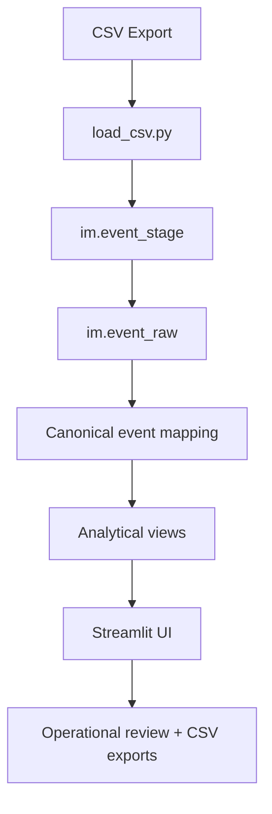

# Architecture

## System Overview
IncidentOps PMI Hub uses a simple but explicit analytics pipeline:

1. A semicolon-delimited incident event log is exported from a source system
2. The Python loader validates, normalizes, keys, and inserts the data into PostgreSQL
3. SQL scripts create the schema, seed reference data, and build analytical views
4. The Streamlit application queries those views and presents stakeholder-focused workstreams

## Data Flow

## Main Subsystems

### Ingestion
- [pipeline/load_csv.py](../pipeline/load_csv.py)
- Maps source columns into the expected schema
- Parses timestamps and validates required fields
- Computes `event_key` hashes for idempotent loading
- Loads via `im.event_stage`, then inserts into `im.event_raw`

### Database Modeling
- [scripts/01_create_schema.sql](../scripts/01_create_schema.sql)
- [scripts/03_seed_reference.sql](../scripts/03_seed_reference.sql)
- [scripts/02_views.sql](../scripts/02_views.sql)
- Separates raw storage, canonical event taxonomy, and analytical views
- Keeps dashboard-facing query contracts in SQL rather than embedding business logic in the UI

### UI Layer
- [app.py](../app.py)
- [ui/theme.py](../ui/theme.py)
- [ui/primitives.py](../ui/primitives.py)
- [ui/charts.py](../ui/charts.py)
- Uses a shared theme/token layer and reusable UI primitives
- Organizes the experience into six workstreams: `Command Center`, `Flow`, `Handoffs`, `Quality`, `Intake`, `Enablement`

### Test Coverage
- [tests](../tests)
- Covers loader normalization rules, SQL object expectations, and app query contracts
- Database-backed tests are optional and enabled through `TEST_DATABASE_URL`

## Deployment Expectations
- Local or portfolio-hosted Streamlit deployment
- PostgreSQL connection provided via environment variables
- `DATABASE_URL_DIRECT` is required for SQL bootstrap
- `DATABASE_URL_POOLED` is preferred by the app when available

## Secrets And Config
- [.env.example](../.env.example) shows required variables
- `.env` is intentionally local-only
- Streamlit secrets can be used as an alternative to environment variables

## Design Notes
- The repo favors reproducibility and portfolio readability over complex infrastructure
- Business logic lives primarily in SQL views, which keeps the UI thinner and easier to explain
- The analytics model is designed to support process review, not operational ticket execution
